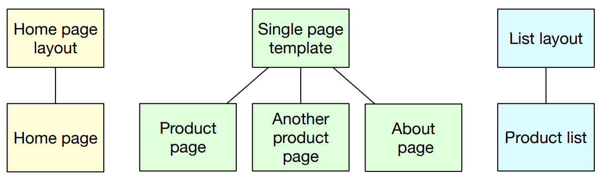

# Create new website

1. hugo new website portfolio

## Start hugo server

1. hugo server

## Access to hugo

1. curl <http://localhost:1313>

## The home page

1. layouts/index.html - which defines an HTML skeleton only for the home page
1. The `layouts/index.html` content

    ```html
    <!DOCTYPE html>
    <html lang="en-US">

    <head>
        <meta charset="utf-8">
        <title>{{ .Site.Title }}</title>
    </head>

    <body>
        <h1>{{ .Site.Title }}</h1>
        <!--content/_index.md-->
        {{ .Content }}
    </body>

    </html>
    ```

## Variables of hugo

1. The sample of config.toml file

    ```bash
    baseURL = 'http://example.org/'
    languageCode = 'en-us'
    title = 'My New Hugo Site'
    ```

1. From config.toml file, there are define variables.

    ```bash
    Context (.) # The current context in a template is represented by the dot.
    |--Site.
    |    |--Title # Access title of site => .Site.Title
    |--Title # Access title of page => .Title
    |__Content # Hugo will look for the content in a file named _index.md in the content directory.
    ```

## Hugo Layout template



## Create About Page

1. The defautl `archetypes/default.md` content

    ```yml
    ---
    title: "{{ replace .Name "-" " " | title }}"
    date: {{ .Date }}
    draft: true
    ---
    ```

1. `hugo new about.md` - `content/about.md` using `archetypes/default.md` file as template.
1. The `content/about.md` content

    ```yml
    ---
    title: "About"
    date: 2022-05-30T15:26:39+07:00
    draft: true
    ---
    ```

1. To access to about page. `We need to single page layouts for each content type`
1. To create a default single page layout that every content page will use, store it in the `layouts/_default` directory
1. Create `layouts/_default/single.html` with content

    ```html
    <body>
        <h1>{{ .Site.Title}}</h1>
        <h2>{{ .Title }}</h2>
        <!-- content/*.md not content/_index.md-->
        {{ .Content }}
    </body>

    ```

## Using Hugo to build

1. `hugo --minify`

    ```bash
    Start building sites …
    hugo v0.93.2 linux/amd64 BuildDate=2022-03-06T10:38:19Z

    create a template file which matches Hugo Layouts Lookup Rules for this combination.

                       | EN
    -------------------+-----
      Pages            |  5
      Paginator pages  |  0
      Non-page files   |  0
      Static files     |  0
      Processed images |  0
      Aliases          |  0
      Sitemaps         |  1
      Cleaned          |  0

    Total in 10 ms
    ```

1. the build process to create all pages we need

    ```bash
    public/
    ├── about
    │   └── index.html
    ├── categories
    │   └── index.xml
    ├── index.html
    ├── index.xml
    ├── sitemap.xml
    └── tags
        └── index.xml
    ```
